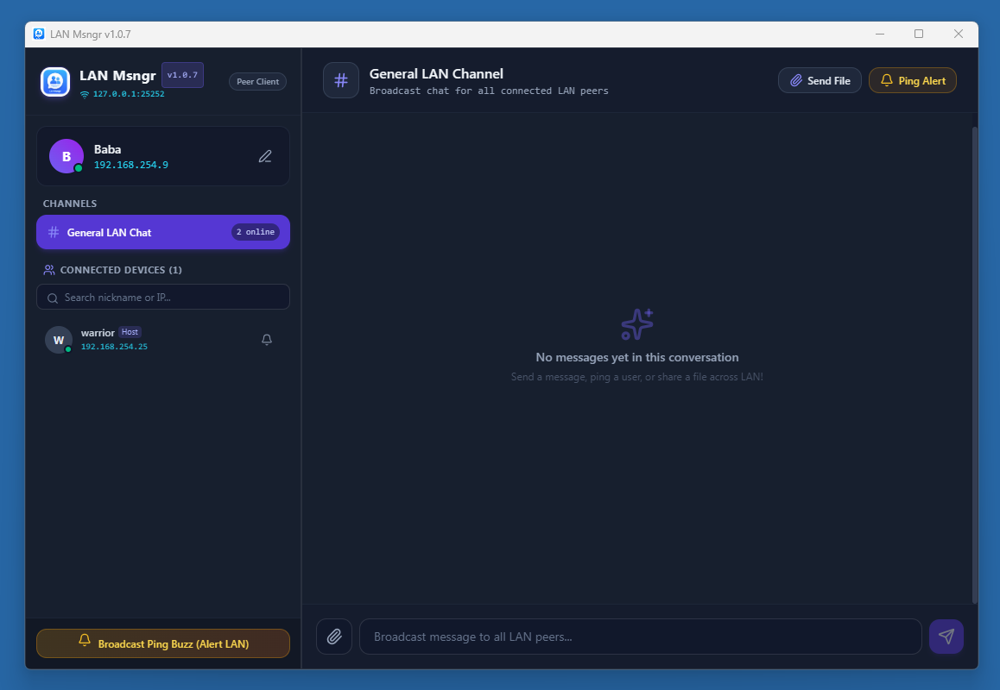

# LAN Msngr



A modern, cross-platform messaging and file sharing ecosystem built with **Go**, **Wails v2**, **React**, **Tailwind CSS**, and **React Native (Expo)** for high-speed communication across Local Area Networks (LAN).

---

## Architecture Overview

- **Auto-Server Election & UDP Discovery**:
  - The first node launched on a LAN binds TCP port `25252` and becomes the **Host Server**, broadcasting heartbeats over UDP port `25253`.
  - Subsequent desktop and mobile instances auto-discover the host via UDP and connect as **Peer Clients**.
- **Real-Time P2P Chat & File Streaming**:
  - Supports General broadcast channel and 1-on-1 private messaging.
  - Efficient chunked binary file transfer streams directly between devices.
- **Multiline Text & Monospace ASCII Art**:
  - Preserves exact spaces, line breaks, and monospace character alignment for ASCII art and code snippets.
- **Audio Chime & Buzz Alerts**:
  - Web Audio API synth chimes and ping alerts notify users across connected network devices.

---

## Repository Structure

- **[`desktop/`](./desktop)**: Desktop app built with **Go**, **Wails v2**, **React**, and **Tailwind CSS**.
- **[`android/`](./android)**: Mobile app built with **React Native**, **TypeScript**, and **Expo (SDK 54)**.

---

## Live Development

### Desktop App
```bash
cd desktop
wails dev
```
*Starts Vite dev server with hot-reloading for React frontend and Go backend bindings.*

### Android App
```bash
cd android
npm run start
```
*Launches Expo SDK 54 bundler. Scan the QR code using the **Expo Go** app on your Android phone.*

---

## Production Build Instructions

### 1. Build Desktop Executable (`lanmsngr.exe`) & Release Package

#### Automated Release Build (Recommended)
Run the automated PowerShell release script from either the root folder or `desktop/`:
```powershell
.\build.ps1
```
This script dynamically extracts the version from `wails.json`, runs `wails build`, and packages `lanmsngr.exe`, `LICENSE`, `README.md`, and `lanmsngr.png` into:
- **Release Directory**: `release/LanMsngr-win-v<version>/`
- **ZIP Archive**: `release/LanMsngr-win-v<version>.zip`

#### Manual Wails CLI Build
```bash
cd desktop
wails build
```
The compiled executable will be placed in `desktop/build/bin/lanmsngr.exe`.

---

### 📱 Mobile App (React Native / Expo)

1. Navigate to the mobile directory:
   ```bash
   cd mobile
   ```

2. Install dependencies:
   ```bash
   npm install
   ```

3. Build & Run:

#### Option A: Expo Go (Development)
```bash
cd mobile
npm run start
```

#### Option B: Standalone Android APK Build (via EAS Cloud)
```bash
cd mobile
npx eas build -p android --profile preview
```

#### Option C: Native Offline APK Build (via Gradle)

- **For Standalone Offline Testing (No Metro server needed on PC)**:
  ```bash
  cd mobile/android
  ./gradlew assembleRelease --no-daemon
  ```
  *Output*: `mobile/android/app/build/outputs/apk/release/app-release.apk`

- **For Active Live Development (With Metro running on PC)**:
  ```bash
  # 1. Start Metro server in terminal 1:
  cd mobile && npm run start

  # 2. Build & install Debug APK:
  cd mobile/android && ./gradlew assembleDebug --no-daemon
  ```

---

## License

Distributed under the [MIT License](LICENSE).  
Copyright (c) 2026 bhu1st.
