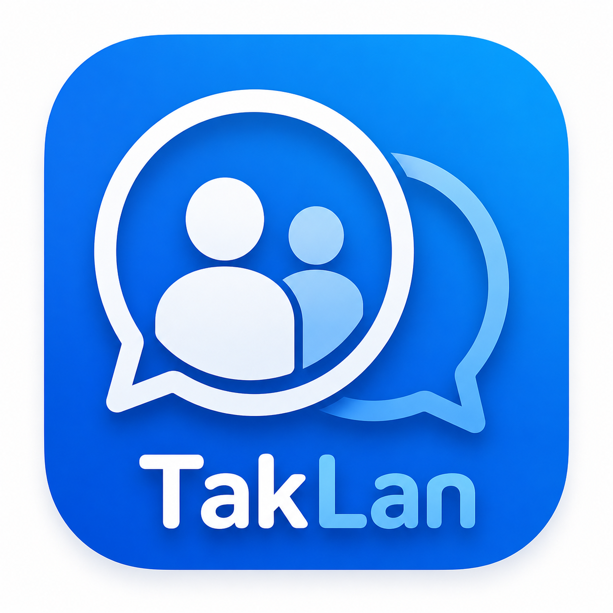
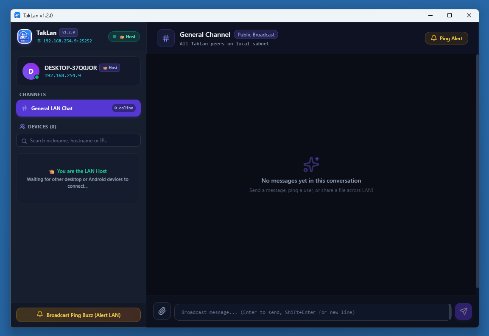

# TakLan



A modern, cross-platform messaging and file sharing ecosystem built with **Go**, **Wails v2**, **React**, **Tailwind CSS**, and **React Native (Expo)** for high-speed communication across Local Area Networks (LAN).

---

## 📸 Preview



---

## Architecture Overview

- **Auto-Server Election & UDP Discovery**:
  - The first node launched on a LAN binds TCP port `25252` and becomes the **Host Server**, broadcasting heartbeats over UDP port `25253`.
  - Subsequent desktop and mobile instances auto-discover the host via UDP and connect as **Peer Clients**.
- **Real-Time P2P Chat & File Streaming**:
  - Supports General broadcast channel and 1-on-1 private messaging.
  - Efficient chunked binary file transfer streams directly between devices.
- **Multiline Text & Monospace ASCII Art**:
  - Preserves exact spaces, line breaks, and monospace character alignment for ASCII art and code snippets.
- **Audio Chime & Buzz Alerts**:
  - Web Audio API synth chimes and ping alerts notify users across connected network devices.

---

## Repository Structure

- **[`desktop/`](./desktop)**: Desktop app built with **Go**, **Wails v2**, **React**, and **Tailwind CSS**.
- **[`mobile/`](./mobile)**: Mobile app built with **React Native**, **TypeScript**, and **Expo (SDK 54)**.

---

## Live Development

### Desktop App
```bash
cd desktop
wails dev
```
*Starts Vite dev server with hot-reloading for React frontend and Go backend bindings.*

### Android App
```bash
cd android
npm run start
```
*Launches Expo SDK 54 bundler. Scan the QR code using the **Expo Go** app on your Android phone.*

---

## Production Build Instructions

### 1. Build Desktop Executable (`TakLan.exe`) & Release Package

#### Automated Release Build (Recommended)
Run the automated PowerShell release script from either the root folder or `desktop/`:
```powershell
.\build.ps1
```
This script dynamically extracts the version from `wails.json`, runs `wails build`, and packages `TakLan.exe`, `LICENSE`, `README.md`, and `TakLan.png` into:
- **Release Directory**: `release/TakLan-win-v<version>/`
- **ZIP Archive**: `release/TakLan-win-v<version>.zip`

#### Manual Wails CLI Build
```bash
cd desktop
wails build
```
The compiled executable will be placed in `desktop/build/bin/TakLan.exe`.

---

### 📱 Mobile App (React Native / Expo)

1. Navigate to the mobile directory:
   ```bash
   cd mobile
   ```

2. Install dependencies:
   ```bash
   npm install
   ```

3. Build & Run:

> **⚠️ SQLite Requirement**: The app uses `expo-sqlite` for local chat history, which is a **native module** and requires a **native build**. It will not work with plain Expo Go.

#### Option A: Local Native Build — SQLite Enabled ✅ (Recommended)
Generates native Android project from Expo config, then builds and installs on your connected device/emulator:
```bash
cd mobile

# Step 1 — Generate native Android project:
npx expo prebuild --platform android --clean

# Step 2 — Build release APK and install on device:
cd android
./gradlew installRelease --no-daemon
```
> Requires Android Studio with a connected device or running emulator. Run `npx expo prebuild` again whenever you add new native dependencies.

#### Option B: Debug Build with Metro Hot-Reload
For active development with live code reload:
```bash
cd mobile

# Step 1 — Generate native Android project (first time or after native dep changes):
npx expo prebuild --platform android

# Step 2 — Start Metro bundler (Terminal 1):
npm run start

# Step 3 — Build & install debug APK (Terminal 2):
cd android && ./gradlew installDebug --no-daemon
```

#### Option C: Expo Go — SQLite Disabled ⚠️
For quick UI preview only (chat/file transfer works, history does not persist):
```bash
cd mobile
npm run start
# Scan QR code with Expo Go app
```

#### Option D: Standalone Release APK (via Gradle, no device)
```bash
cd mobile/android
./gradlew assembleRelease --no-daemon
```
*Output*: `mobile/android/app/build/outputs/apk/release/app-release.apk`

#### Option E: EAS Cloud Build
```bash
cd mobile
npx eas build -p android --profile preview
```

---

## License

Distributed under the [MIT License](LICENSE).  
Copyright (c) 2026 bhu1st.
